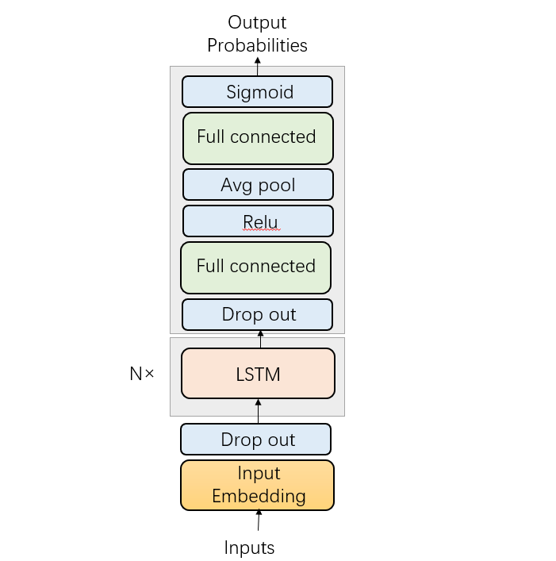
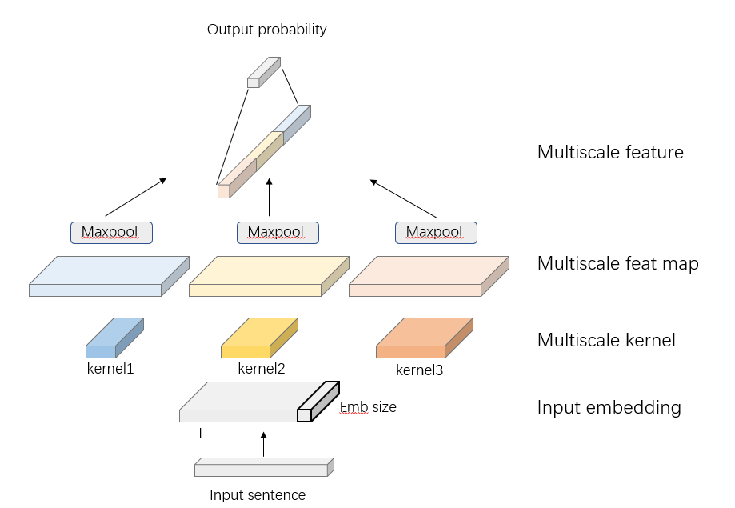
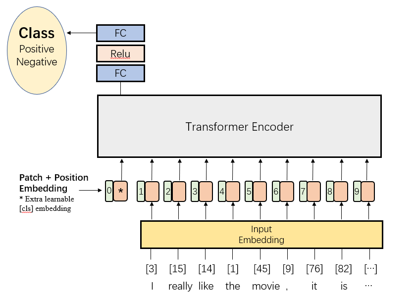

# IMDB Sentiment Analysis

**This is the final project of *Machine Learning* Courses in Huazhong University of Science and Technology, School of Artificial Intelligence and Automation**

### Training

To train a model (CNN, LSTM, Transformer), simply run

```sh
python train.py --cfg <./model/xxx> --save <./save/>
```

You can change the configuration in [config](./config).

### Model

#### LSTM

we follow the origin [LSTM](http://citeseerx.ist.psu.edu/viewdoc/download?doi=10.1.1.676.4320&rep=rep1&type=pdf) as possible



#### CNN

we adopt the methods mentioned in *[Effective Use of Word Order for Text Categorization with Convolutional Neural Networks](https://arxiv.org/pdf/1412.1058.pdf)*



#### Transformer

We use the original Transformer Encoder as *[Attention is all you need](https://proceedings.neurips.cc/paper/2017/file/3f5ee243547dee91fbd053c1c4a845aa-Paper.pdf)* and use the concept of `CLS` Token as *[BERT: Pre-training of Deep Bidirectional Transformers for Language Understanding](https://arxiv.org/pdf/1810.04805.pdf&usg=ALkJrhhzxlCL6yTht2BRmH9atgvKFxHsxQ)*



### Experiment result

#### Model Comparison

| Model           | Accuracy  |
| --------------- | --------- |
| LSTM            | 89.02     |
| Transformer     | 87.47     |
| CNN             | 88.66     |
| Fine-tuned BERT | **93.43** |

#### LSTM

##### Batch size

| Batch size | Loss       | Accuracy   |
| ---------- | ---------- | ---------- |
| 64         | **0.4293** | 0.8802     |
| 128        | 0.4298     | 0.8818     |
| 256        | 0.4304     | **0.8836** |
| 512        | 0.4380     | 0.8807     |

##### Embedding Size

| Embedding size | train Loss | train Accuracy | val loss   | val accuracy |
| -------------- | ---------- | -------------- | ---------- | ------------ |
| 32             | 0.4021     | 0.9127         | 0.4419     | 0.8707       |
| 64             | 0.3848     | 0.9306         | 0.4297     | 0.8832       |
| 128            | 0.3772     | 0.9385         | **0.4265** | **0.8871**   |
| 256            | 0.3584     | 0.9582         | 0.4303     | 0.8825       |
| 512            | **0.3504** | **0.9668**     | 0.4295     | 0.8838       |

##### Drop out

| Drop out rate | Train Loss | Train Accuracy | Test loss  | Test Accuracy |
| ------------- | ---------- | -------------- | ---------- | ------------- |
| 0.0           | 0.3554     | 0.9623         | 0.4428     | 0.8704        |
| 0.1           | **0.3475** | **0.9696**     | 0.4353     | 0.8780        |
| 0.2           | 0.3516     | 0.9652         | 0.4312     | 0.8825        |
| 0.3           | 0.3577     | 0.9589         | 0.4292     | 0.8844        |
| 0.4           | 0.3587     | 0.9576         | 0.4272     | **0.8868**    |
| 0.5           | 0.3621     | 0.9544         | **0.4269** | 0.8865        |
| 0.6           | 0.3906     | 0.9242         | 0.4272     | 0.8863        |
| 0.7           | 0.3789     | 0.9356         | 0.4303     | 0.8826        |
| 0.8           | 0.3939     | 0.9204         | 0.4311     | 0.8826        |
| 0.9           | 0.4211     | 0.8918         | 0.4526     | 0.8584        |

##### Weight decay

| Weight decay | train loss | train accuracy | test loss  | test accuracy |
| ------------ | ---------- | -------------- | ---------- | ------------- |
| 1.0e-8       | 0.3716     | 0.9436         | **0.4261** | 0.8876        |
| 1.0e-7       | 0.3803     | 0.9349         | 0.4281     | 0.8862        |
| 1.0e-6       | **0.3701** | **0.9456**     | 0.4264     | **0.8878**    |
| 1.0e-5       | 0.3698     | 0.9461         | 0.4283     | 0.8850        |
| 1.0e-4       | 0.3785     | 0.9377         | 0.4318     | 0.8806        |

##### Number layers

*Number of LSTM blocks*

| Number layers | train loss | train accuracy | test loss  | test accuracy |
| ------------- | ---------- | -------------- | ---------- | ------------- |
| 1             | 0.3786     | **0.9364**     | 0.4291     | 0.8844        |
| 2             | **0.3701** | 0.9456         | 0.4264     | 0.8878        |
| 3             | 0.3707     | 0.9451         | **0.4243** | **0.8902**    |
| 4             | 0.3713     | 0.9446         | 0.4279     | 0.8857        |

#### CNN

##### out channel size

| out size | train acc  | test acc   |
| -------- | ---------- | ---------- |
| 8        | 0.9679     | 0.8743     |
| 16       | 0.9791     | 0.8767     |
| 32       | 0.9824     | 0.8811     |
| 64       | 0.9891     | **0.8848** |
| 128      | 0.9915     | 0.8824     |
| 256      | 0.9909     | 0.8827     |
| 512      | 0.9920     | 0.8841     |
| 1024     | **0.9959** | 0.8833     |

##### multi scale filter

| Number                    | train acc  | test acc   |
| ------------------------- | ---------- | ---------- |
| 1 [5]                     | 0.9698     | 0.8748     |
| 2 [5, 11]                 | 0.9852     | 0.8827     |
| 3 [5, 11, 17]             | 0.9890     | **0.8850** |
| 4 [5, 11, 17, 23]         | 0.9915     | 0.8848     |
| 5 [5, 11, 17, 23, 29]     | 0.9924     | 0.8842     |
| 6 [5, 11, 17, 23, 29, 35] | **0.9930** | 0.8836     |

| step        | train acc  | test acc   |
| ----------- | ---------- | ---------- |
| 2 [5 7 9]   | 0.9878     | 0.8816     |
| 4 [5 9 11]  | 0.9890     | 0.8816     |
| 6 [5 11 17] | 0.9919     | 0.8834     |
| 8 [5 13 21] | 0.9884     | 0.8836     |
| 10[5 15 25] | 0.9919     | **0.8848** |
| 12[5 17 29] | 0.9898     | 0.8812     |
| 14[5 29 43] | **0.9935** | 0.8809     |
